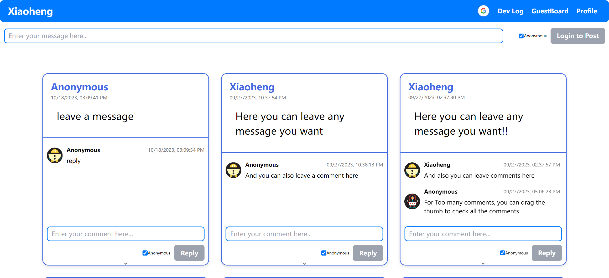

# XiaoHeng Website

## Overview
The XiaoHeng website is a platform that features three main components: a Development Log, a Guest Board for message posting, and a Profile section. It is designed to allow users to engage with the community through signed or anonymous messages and comments upon logging in.

## Components

### Dev Log
The Development Log provides a chronological account of updates and progression in the development of the website. It serves as a transparent history of features and improvements made over time.

### Guest Board
The Guest Board is a space where registered users can post messages and comments. This can be done either anonymously or with a username, fostering both open and private conversations.

### Profile
The Profile section offers insights into the creator of the website. It contains details such as professional background, interests, and any other personal information the creator wishes to share.

## Architecture
- The website is structured to facilitate easy navigation between the Dev Log, Guest Board, and Profile.
- Secure login functionality ensures user identity protection and allows for anonymous interactions on the Guest Board.
- A responsive design ensures the website is accessible across various devices and screen sizes.

## Usage
Users can interact with the website by posting messages on the Guest Board after logging in, tracking development updates in the Dev Log, and learning more about the developer in the Profile section.

## Future Plan
A new feature for the XiaoHeng website—a dedicated page where users can post their photos. This interactive space will not only allow for photo sharing but will also provide the freedom to place these images anywhere on the page, giving users a creative way to personalize their display and engage with the community."

---

For more information, please refer to the navigation menu on the website or contact the developer directly.

© 2024 XiaoHeng. All rights reserved.
